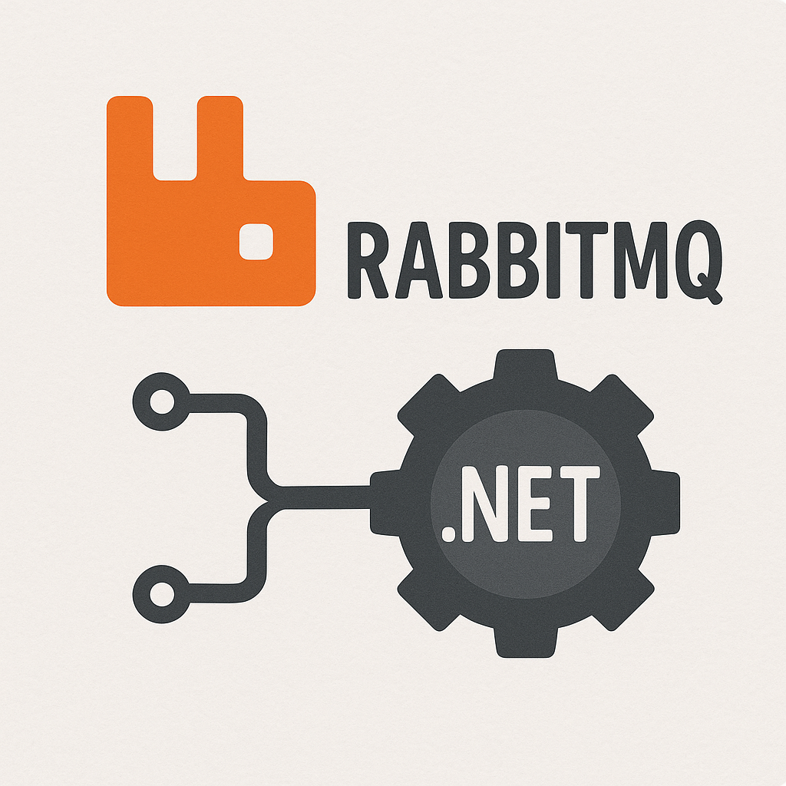

# RabbitMQAdvancedClient



Продвинутая библиотека-клиент для работы с RabbitMQ в .NET приложениях. Обеспечивает простой и надежный API для публикации и подписки на сообщения, с поддержкой повторных попыток подключения, логирования и управления подтверждениями сообщений.

## Содержание

- [Возможности](#возможности)
- [Установка](#установка)
- [Настройка](#настройка)
  - [Параметры подключения](#параметры-подключения)
- [Использование](#использование)
  - [Интеграция с Dependency Injection](#интеграция-с-dependency-injection)
  - [Публикация сообщений](#публикация-сообщений)
  - [Подписка на сообщения](#подписка-на-сообщения)
  - [Управление подтверждениями сообщений](#управление-подтверждениями-сообщений)
- [Примеры](#примеры)
  - [Базовый пример](#базовый-пример)
  - [Продвинутый пример](#продвинутый-пример)
- [Требования](#требования)
- [Лицензия](#лицензия)

## Возможности

- Простой и удобный API для работы с RabbitMQ
- Полная асинхронность (async/await)
- Автоматические повторные подключения при обрыве соединения
- Встроенная поддержка логирования с NLog
- Сериализация/десериализация JSON сообщений
- Управление подтверждениями сообщений (Ack/Nack)
- Готовая интеграция с .NET Dependency Injection
- Типизированные сообщения (generic типы)

## Установка

Для установки пакета RabbitMQAdvancedClient используйте NuGet Package Manager:
dotnet add package RabbitMQAdvancedClient
## Настройка

### Параметры подключения

Для подключения к RabbitMQ серверу необходимо настроить параметры подключения с помощью класса `RabbitMqOptions`:
```csharp
var options = new RabbitMqOptions
{
    Host = "localhost",     // Хост сервера RabbitMQ (по умолчанию "localhost")
    Port = 5672,            // Порт сервера RabbitMQ (по умолчанию 5672)
    Username = "guest",     // Имя пользователя (по умолчанию "guest")
    Password = "guest",     // Пароль пользователя (по умолчанию "guest")
    RetryCount = 3,         // Количество попыток переподключения (по умолчанию 3)
    RetryDelay = 5          // Задержка между попытками в секундах (по умолчанию 5)
};
```
## Использование

### Интеграция с Dependency Injection

Библиотека поддерживает интеграцию с .NET Dependency Injection. Добавьте следующий код в метод `ConfigureServices` вашего `Startup.cs` или в конфигурацию сервисов:

```csharp
// Регистрация с помощью делегата настройки
services.AddRabbitMq(options => 
{
    options.Host = "rabbitmq.example.com";
    options.Port = 5672;
    options.Username = "user";
    options.Password = "password";
    options.RetryCount = 5;
    options.RetryDelay = 10;
});

// ИЛИ регистрация с использованием предварительно настроенного объекта
var rabbitOptions = new RabbitMqOptions
{
    Host = "rabbitmq.example.com",
    // другие настройки...
};
services.AddRabbitMq(rabbitOptions);
```

После регистрации вы можете внедрить `IRabbitMqClient` в ваши сервисы:

```csharp
public class MyService
{
    private readonly IRabbitMqClient _rabbitMqClient;

    public MyService(IRabbitMqClient rabbitMqClient)
    {
        _rabbitMqClient = rabbitMqClient;
    }

    // Используйте _rabbitMqClient для публикации и подписки на сообщения
}
```
### Публикация сообщений

Для публикации сообщений используйте метод `PublishAsync<T>`:

```csharp
// Определение класса сообщения
public class OrderCreatedMessage
{
    public int OrderId { get; set; }
    public decimal Amount { get; set; }
    public DateTime CreatedAt { get; set; }
}

// Публикация сообщения
await _rabbitMqClient.PublishAsync(queueName: "orders.created", new OrderCreatedMessage
{
    OrderId = 12345,
    Amount = 99.99m,
    CreatedAt = DateTime.UtcNow
});
```

### Подписка на сообщения

Для подписки на сообщения используйте метод `SubscribeAsync<T>`:

```csharp
// Подписка с автоматическим подтверждением сообщений
await _rabbitMqClient.SubscribeAsync<OrderCreatedMessage>(
    queueName: "orders.created",
    onMessageReceived: async (message, context) =>
    {
        Console.WriteLine($"Получен заказ #{message.OrderId} на сумму {message.Amount}");
        // Обработка сообщения...
    },
    autoAck: true
);

// Подписка с ручным подтверждением сообщений
await _rabbitMqClient.SubscribeAsync<OrderCreatedMessage>(
    queueName: "orders.created",
    onMessageReceived: async (message, context) =>
    {
        try
        {
            Console.WriteLine($"Обработка заказа #{message.OrderId}");
            // Обработка сообщения...
            
            // Подтверждение успешной обработки
            await context.AckAsync();
        }
        catch (Exception ex)
        {
            // Отклонение сообщения с повторной постановкой в очередь
            await context.NackAsync(requeue: true);
        }
    },
    autoAck: false
);
```

### Управление подтверждениями сообщений

Для ручного управления подтверждениями сообщений используйте методы `AckAsync()` и `NackAsync()` из объекта `MessageContext`:

```csharp
await _rabbitMqClient.SubscribeAsync<MyMessage>(
    queueName: "my.queue",
    onMessageReceived: async (message, context) =>
    {
        try
        {
            // Успешная обработка
            await context.AckAsync();
        }
        catch (Exception)
        {
            // Неудачная обработка, повторить позже
            await context.NackAsync(requeue: true);
            
            // Или отправить в Dead Letter Queue
            // await context.NackAsync(requeue: false);
        }
    },
    autoAck: false
);
```

## Примеры

### Базовый пример
```csharp
// Простой пример публикации и подписки

// 1. Настройка сервисов
services.AddRabbitMq(options => 
{
    options.Host = "localhost";
    options.Username = "guest";
    options.Password = "guest";
});

// 2. Использование в сервисе
public class NotificationService
{
    private readonly IRabbitMqClient _rabbitMqClient;

    public NotificationService(IRabbitMqClient rabbitMqClient)
    {
        _rabbitMqClient = rabbitMqClient;
    }

    public async Task SendNotificationAsync(string userId, string message)
    {
        await _rabbitMqClient.PublishAsync(queueName: "notifications", new
        {
            UserId = userId,
            Message = message,
            Timestamp = DateTime.UtcNow
        });
    }

    public async Task StartNotificationProcessingAsync()
    {
        await _rabbitMqClient.SubscribeAsync<dynamic>(
            queueName: "notifications",
            async (notification, context) =>
            {
                Console.WriteLine($"Отправка уведомления пользователю {notification.UserId}: {notification.Message}");
                // Логика отправки уведомления...
            }
        );
    }
}
```

### Продвинутый пример

```csharp
// Более сложный пример с обработкой ошибок и ручным подтверждением

// Класс сообщения
public class PaymentProcessedMessage
{
    public string TransactionId { get; set; }
    public string CustomerId { get; set; }
    public decimal Amount { get; set; }
    public bool Success { get; set; }
    public string ErrorMessage { get; set; }
}

// Сервис обработки платежей
public class PaymentService
{
    private readonly IRabbitMqClient _rabbitMqClient;
    private readonly ILogger<PaymentService> _logger;

    public PaymentService(IRabbitMqClient rabbitMqClient, ILogger<PaymentService> logger)
    {
        _rabbitMqClient = rabbitMqClient;
        _logger = logger;
    }

    public async Task ProcessPaymentAsync(string customerId, decimal amount)
    {
        var transactionId = Guid.NewGuid().ToString();
        
        try
        {
            // Логика обработки платежа...
            bool paymentSuccessful = await ProcessPaymentLogic(customerId, amount);
            
            // Публикация результата
            await _rabbitMqClient.PublishAsync(queueName: "payments.processed", new PaymentProcessedMessage
            {
                TransactionId = transactionId,
                CustomerId = customerId,
                Amount = amount,
                Success = paymentSuccessful,
                ErrorMessage = paymentSuccessful ? null : "Insufficient funds"
            });
        }
        catch (Exception ex)
        {
            _logger.LogError(ex, "Ошибка при обработке платежа");
            
            // Публикация сообщения об ошибке
            await _rabbitMqClient.PublishAsync(queueName: "payments.processed", new PaymentProcessedMessage
            {
                TransactionId = transactionId,
                CustomerId = customerId,
                Amount = amount,
                Success = false,
                ErrorMessage = ex.Message
            });
        }
    }

    public async Task StartPaymentNotificationServiceAsync()
    {
        await _rabbitMqClient.SubscribeAsync<PaymentProcessedMessage>(
            queueName: "payments.processed",
            async (payment, context) =>
            {
                try
                {
                    if (payment.Success)
                    {
                        _logger.LogInformation(
                            "Успешный платеж: Транзакция {TransactionId}, Клиент {CustomerId}, Сумма {Amount}",
                            payment.TransactionId, payment.CustomerId, payment.Amount);
                        
                        // Отправка уведомления клиенту об успешном платеже
                        await SendSuccessNotification(payment);
                    }
                    else
                    {
                        _logger.LogWarning(
                            "Неудачный платеж: Транзакция {TransactionId}, Клиент {CustomerId}, Ошибка: {Error}",
                            payment.TransactionId, payment.CustomerId, payment.ErrorMessage);
                        
                        // Отправка уведомления клиенту о неудачном платеже
                        await SendFailureNotification(payment);
                    }
                    
                    // Подтверждение обработки сообщения
                    await context.AckAsync();
                }
                catch (Exception ex)
                {
                    _logger.LogError(ex, "Ошибка при обработке уведомления о платеже");
                    
                    // Возврат сообщения в очередь для повторной обработки
                    await context.NackAsync(requeue: true);
                }
            },
            autoAck: false
        );
    }

    // Вспомогательные методы...
    private Task<bool> ProcessPaymentLogic(string customerId, decimal amount) => Task.FromResult(true);
    private Task SendSuccessNotification(PaymentProcessedMessage payment) => Task.CompletedTask;
    private Task SendFailureNotification(PaymentProcessedMessage payment) => Task.CompletedTask;
}
```

## Требования

- .NET 9.0 или выше
- RabbitMQ Server 3.8.0 или выше

## Лицензия

Этот проект лицензирован под [MIT License](LICENSE).
